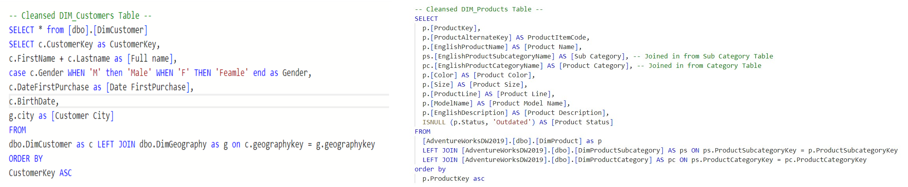
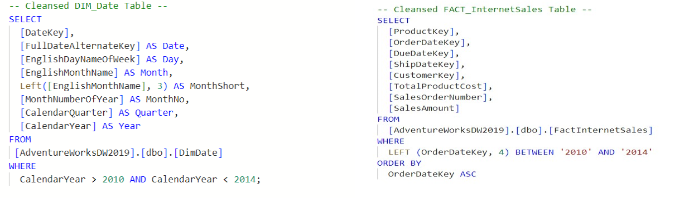
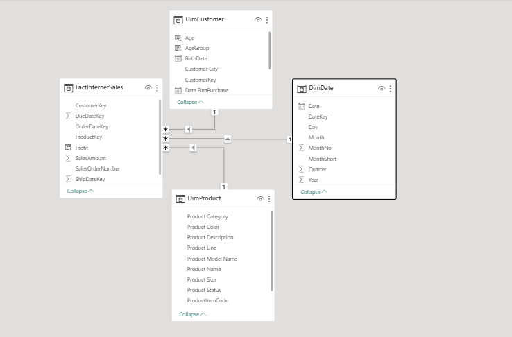
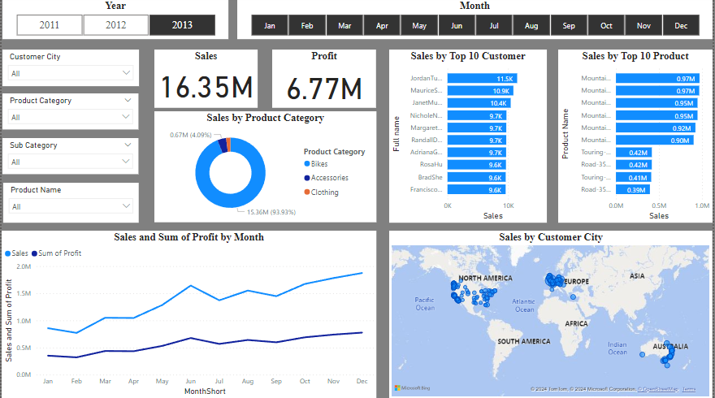
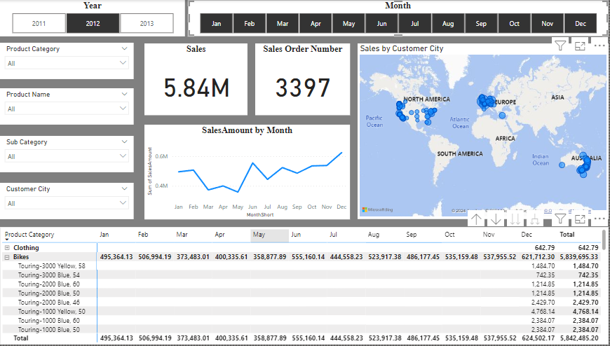

1.Dùng bộ data AdventureWorkWD2019, dùng SQL lấy 4 table và một số cột cần thiết

    

        
    

    

        
    

2. Import các file vào PowerBi, DataModel:

3.Report DashBoard  
3.1 OverView

3.2 Product Deatail

